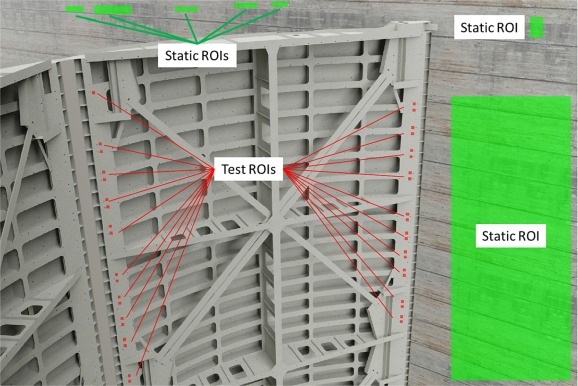
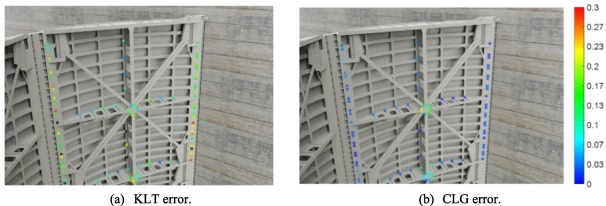
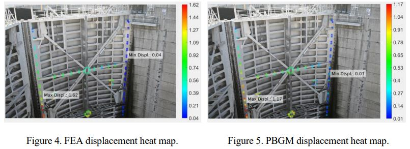

# Vision-based model updating and evaluation of miter gates on inland waterways

This GitHub repository is my code contribution to the paper: Vision-based model updating and evaluation of miter gates on inland waterways. 

The paper can be found here: 
https://www.sciencedirect.com/science/article/pii/S0141029623000883

We also released a conference paper at the International Workshop on Structural Health Monitoring (IWSHM) 2023 that focuses more on the vision-based displacements measurement part.

A link to the conference paper will be posted here once it becomes available.

If you use any part of this code, ideas, or figures below, please be sure to cite both papers!!
 
I was the main or sole developer of several MATLAB scripts for both of these papers including:

* Robust KLT-based optical flow method for displacement measurement (motion_compensate_homography_klt_video.m)
* Visualization script that displays the displacement and displacement errors as a heat map on an image of the structure (disp_heatmap.m)
* Animation script that displays how the displacements change over time along the height of the gate (miterGatePlotAnimation.m)
* Light normalization for all specified images in a folder (light_normalization.m)
* Creates a video from images in a specified folder (createVideo.m)

 Very detailed descriptions of what each script does and how it works can be found in the following sections. For references for this README, please see the papers and their references.

 Note: None of the data or results are given due to security reasons.

 If you would like a copy of either paper, please feel free to email me at: caseyjr2@illinois.edu

## Robust KLT-based optical flow method for displacement measurements

The main input to this script is a folder of images of the structure. The images were taken at regular intervals using a feature of the camera used.

The photos taken were analyzed using computer vision techniques to track the movement of the gates. The computer vision method implemented uses a Kanade-Lucas-Tomasi (KLT) feature tracker to track object movement by measuring pixel displacements. This script also utilizes several techniques to make the pixels easier to track such as light normalization and image homography to compensate for camera motion/drift. Additionally, this script was developed to be very robust for the variety of image sets collected and allow the user flexibility to extract the information desired without additional computational cost. The figure below shows the general steps of the script, where red ovals represent user input.

Firstly, the images are undistorted to correct any camera lens distortion. Camera lens distortion makes lines that are supposed to be straight appear curved, which can cause errors in the pixel tracking. To calculate the parameters of the camera lens distortion for our specific cameras, several experiments involving taking photos of a checkerboard pattern at different angles were run and the Camera Calibrator App in MATLAB was used to estimate camera intrinsics, extrinsics, and lens distortion parameters in order to remove the effects of lens distortion from an image. (Note that to better approximate the lens distortion, the images of the checkerboard pattern need to be captured at a distance roughly equal to the distance from the camera to the objects of interest, i.e., the miter gate, and as a general rule, the checkerboard should fill at least 20% of the captured image. Therefore, for this project, a very large checkerboard pattern is needed, which is hard to achieve. Thus, the conducted experiment can only be an approximation for undistortion of the miter gate images.)

Next, the static and non-static regions of interest (ROI's) along with scale factors for each must be defined. Static ROI’s are regions in the image sets that should not be moving such as a back wall or kerb. These regions will be used to calculate homography later to more accurately account for camera vibration. On the other hand, non-static ROI’s are regions that the user is interested in tracking that are not known as static. Tracking these specific non-static ROI’s rather than performing full optical flow saves a significant amount of computational time and energy since not all of the pixels will be tracked. 

For both types of ROI's, the user can define them by either: 1.) Selecting the ROI's manually, 2.) Loading ROI's they have already manually selected, or 3.) Loading a .csv file with pixel coordinates for each point they want to investigate. For option 3, these pixel coordinates are then converted into square ROI's with a user specified half length. For the paper, static ROI's were chosen manually and non-static ROI's were chosen via option 3.

Along with defining these ROI's, one must also input a scaling factor for each, so that the pixel displacements can later be converted to physical displacement in millimeters. If the user loads previously manually selected ROI's, then the corresponding scaling factors are loaded along with them. Otherwise, three options were implemented for scaling: 1.) The user draws a line for a known distance near the ROI and inputs the value, 2.) The user inputs the camera distance to the ROI, 3.) A .csv file with 3D global coordinates corresponding to the ROI's is loaded and used to automatically calculate the scaling factors. 

The figure below shows an example of selected ROI’s, where the green boxes show static ROI’s and the red boxes show non-static or "test" ROI’s. In this case, the back wall is used as the static ROI’s and the weld access holes and bolts near the miters are used for the non-static ROI’s.

Afterwards, local light normalization is implemented to allow features to be more easily distinct and therefore easier to track. It also helps eliminate shadows and sudden changes in lighting, which can negatively impact accurate pixel tracking. 

Next, features to track are chosen. The user can choose these by hand using MATLAB's Control Point Selection tool or they can be optimally chosen using a Harris corner detector with different options for extraction. The number of features to track can be different for each ROI or can be the same for each type (static and non-static) of ROI. If the optimally chosen feature detection route is picked, then the user can also decide whether the strongest features are chosen or a more uniform spectrum of features are chosen across the area. If the area is smaller, stronger features would be optimal to pick, while larger areas may desire a more uniform feature selection. 

Once the features have been picked, the user will have a chance to see preliminary results through the debugging section. This section is meant to allow the user to determine whether they want to choose a new area or different features points before running it on the entire data set. This can be a huge time saver. 

Afterwards, the script runs through each image in the image set and calculates the pixel displacement of the feature points using KLT tracking, comparing the current image to the first image. The pixel tracking is a type of optical flow, which is the apparent motion of brightness patterns in an image. Ideally, optical flow would be the same as the motion field. In computer vision, the Lucas–Kanade (LK) method is a widely used differential method for optical flow estimation developed by Bruce D. Lucas and Takeo Kanade. It assumes that the flow is essentially constant in a local neighbourhood of the pixels under consideration, and solves the basic optical flow equations for all the pixels in that neighbourhood, by the least squares criterion. By combining information from several nearby pixels, the LK method can often resolve the inherent ambiguity of the optical flow equation. It is also less sensitive to image noise than pointwise methods. Kanade–Lucas–Tomasi (KLT) feature tracker combines feature detectors with the LK method, using an interest point/feature detector such as a Harris Corner Detector, to detect good features to track first, and then it does the tracking using the LK method. There is also an option in the script to allow the user to skip a certain number of images each iteration to save computational time.

Once the KLT tracking is complete, homography is calculated by matching the tracked static features to compensate for camera vibration and to keep static ROI's static. The camera should ideally be fixed during the shooting so that the static regions remain unmoved in different image frames. However, due to wind sway, static regions in the image sets such as a back wall or kerb are not completely overlapped in different frames. Therefore, the calculated deformation of the miter gates is not only actual gate movements but can also include camera motion as well, making the displacements inaccurate. Because of the use of tripods, it is reasonable to assume that the camera position is fixed, only rotation exists. Homography is perfect to account for the transformation between images from two cameras that share the same center. A homography is a transformation (a 3×3 matrix) that maps the points in one image to the corresponding points in the other image. It is used here to move the points in raw images to where they should be if there was no camera motion, i.e., transform different sets of data into one coordinate system. Descriptor-based feature matching was applied to get the point correspondences between the following frames compared to the first one; then direct linear transformation (DLT) was applied to calculate the homography matrix using the point pairs. Random sample consensus (RANSAC) was used for the rejection of unreliable matches in an iterative method. Then, a reliable homography matrix is calculated for each frame compared to the first one to make sure that the static regions are well overlapped. Figure 8 shows a graphic to help represent homography, where H is the homography matrix.

Afterwards, the pixel displacements are saved into an array. To help reduce noise and outliers, a moving average is deployed by taking the average of the current frame and the six frames before and after it for each feature point, where the time difference between each frame was 0.5 seconds. The number of frames used in the moving average can be changed by the user. Additionally, for smaller areas, an average of all feature points in that one area can be taken to further reduce noise. For this, outliers more than one standard deviation away from the mean are thrown out. It is not uncommon for local shadows to mess with the tracking, so this is a great way to compensate for that. This ROI averaging is perfect for small ROI’s such as weld access holes or bolts.

Next, these pixel displacements along with other important variables are saved into a file for use in the visualization script as described in the next section.

Then, the pixel displacements are converted to millimeters and plotted as arrows onto the image and added as a frame to a quiver plot video. This tracking, homography, moving average, and plotting process are repeated for each image.

Finally, the data results are plotted and a video of the arrow plots is finished. Results plotted include displacements in pixels and millimeters, angle of displacements, displacements separated into x and y components, and validity scores for the tracking, where 0 means completely invalid and 1 means perfect. These plots are separated into static and non-static plots and can also include individual feature point displacements or ROI average displacements.

## Visualization script that displays the displacement and displacement errors as a heat map on an image of the structure

This script displays displacements or their errors as a heat map on an image of the structure. This helps visualize the context of the displacements and or errors on the structure to help make observations. The errors are the differences between the displacements and the Finite Element Model (FEM) results. This script can also be more generally used to map any numbers to different regions of an image and represent the numbers as a heat map.

First, the script loads the displacement data for the field displacements, the displacements from the Blender Physics-based Graphics Model (PBGM), and the displacements from the FEM. The ROI data is also loaded. The order of the displacements correpond with the order of the ROI's. 

Next, the differences between the displacements are calculated for each component (x and y) and the ROI areas are increased for illustration purposes since areas are typically very small.

Then, heatmaps for the displacements themselves as well as the differences are created. Heatmaps are created by correlating the displacement / error values with a hue number and then coloring the associated ROI with that color. First, the minimum value over all ROI's is set to be equal to the color blue with a hue of 240/360 and the maximum value over all ROI's is set to be equal to the color red with a hue of 0/360. Next, a for loop goes through each ROI, extracts its value, interpolates its color hue, converts the color from HSV to RGB, and finally inserts onto the image the ROI as a colored rectangle. After all of the ROI's are added to the image, labels for the min and max values can be added to the image at their respective locations. Then, the figure is plotted and a color gradient is added to the figure.

Some examples of heat maps from one of the papers are shown below.

## Animation script that displays how the displacements change over time along the height of the gate

For post-processing, another separate script was developed to project the displacements from the image plane to a global coordinate system and then display them as animated plots. Since the main script uses image pixel movements to calculate displacements, the displacements are restrained to the image plane they were taken in. This makes combining data from different image sets difficult as each image set has its own unique image plane. Therefore, projecting these image plane displacements to the same global coordinate system is extremely helpful.

However, there can be limitations to this in that camera images cannot capture motion along the camera line-of-sight path. One helpful solution is the model-informed approach, which is an algorithm that uses knowledge from the finite element model to facilitate the implementation of 2D to 3D projection and can maximize the measurement outcome. Further details of the model-informed approach are described in a paper by Narazaki Y, Gomez F, Hoskere V, Smith MD, Spencer BF.

Additionally, this script is especially helpful for visualization and interpretation of the data. Graphs from the computer vision script can be a bit hard to read and interpret as there are typically several lines plotted, even with the number of points reduced to one per ROI. Displaying the data as animated plots makes it easier to visualize where the displacements are on the gate and their relative magnitude.

First, the script loads the displacement data and the user can choose to either to display the displacements from specified interest points or just use the displacements from the non-static ROI's. If the user chooses to display displacements from specified interest points, then they will be required to input the indices of those interest points they want to see. If the user chooses to display displacements from the non-static ROI's, then the script automatically extracts all of them.

Next, the displacements are converted from image coordinates to global coordinates. This is done by multiplying each displacement component with their corresponding image plane component unit vector and then summing the results. In this case, there are two components: x and y. This gives a vector that represents the displacement in 3D global coordinates.

Then, the positions of the displacements are separated by whether they are on the south gate or the north gate. This is done by comparing the point or ROI x position to the center line x position between the gates. The user inputs the x and y coordinates of both the top and bottom of the center line between the two gates and then an expression is found that takes in a y coordinate and outputs the x coordinate of the centerline that location. This is because oftentimes, the center line is not entirely vertical.

After a point or ROI is separated by which gate they are on, the distance of the point or ROI to the top of the gate is calculated. This is done by finding the Euclidean distance from the point or ROI to a point defined by the user to be the top of the gate. The position for the top of the south gate and the position for the top of the north gate is input by the user. The distance is then converted from pixel units to cm.

Finally, plot animations are created that show the displacement of the gate over time on different points along the height of the gate. The plot shows the north and south gates as different colors and plots the displacement on the x axis and the original distance of the point or ROI to the top of the gate on the y axis. As you go down the y axis, you go down the gate. The displacement plotted can be either the x, y, or z components of displacement or the Euclidean displacement. The script also allows one to make a 3D plot that shows two of the displacement components along the height of the gate. 

## Light normalization for all specified images in a folder

This script is a minor script that performs light normalization for all user specified images in a folder and then saves them in the same folder. This was used for the papers.

## Creates a video from images in a specified folder 

This script is a minor script that creates and saves a video from images in a specified folder. Histogram equalization is performed on each image and each image has the frame number written in the upper right-hand corner. This script assumes the images in the folder are all the same size. 